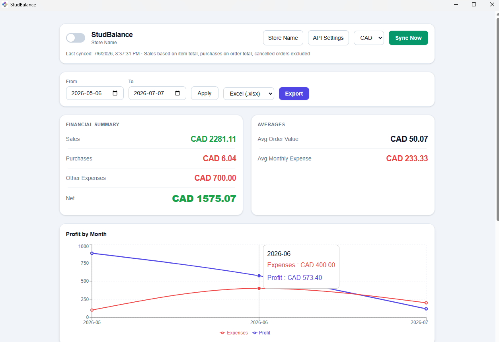
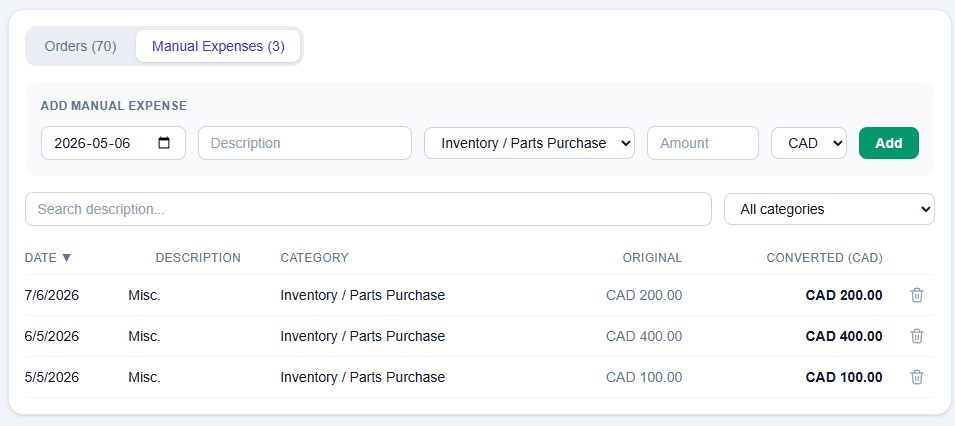
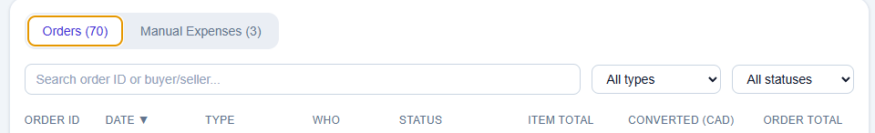

# StudBalance - A BrickLink Income & Expense Tracker

StudBalance is an application that pulls your BrickLink orders (sales + purchases) into a
local database, lets you add manual expenses, and displays a dashboard with summary & insights.
You are able to filter, sort, and view both profits & expenses. 

Essentially, it's a tool for automating your bookkeeping. It adds the sum of your order's item totals,
subtracts expenses (and optionally, purchases), and gives you an overview of your month to month profits 
in a neat line graph.

Like BrickLink, it also allows you to export everything to Excel/XML/CSV/HTML for any date range.

## How To Use
- Open the standalone "StudBalance 0.1.0.exe" file
- Upon your first time running, it will open a popup screen to input your BrickLink API keys (locally stored)
- You can register for BrickLink API keys at https://www.bricklink.com/v2/api/register_consumer.page
- (Optional) You can input a store name as well, but this is purely visual.

### Please Note: You must be connected to the internet for it to pull any data from your BrickLink store.
- Once you have inputted your API keys, you will have access to the main dashboard screen
- Click the green "Sync Now" button to sync all orders from your store.
- This may take a couple of minutes, it depends on how long your store has been running for.

- You should now be able to change currency, filter by date range, add expenses, export, and much more!

## Features

- **Sync Now** - pulls latest sales & purchases from BrickLink.
- **Dark mode** - toggle switch, top left.
- **Currency conversion** - pick a display currency from the dropdown; every
  order/expense is converted using the *historical* exchange rate from its
  own transaction date (via the free Frankfurter API), not today's rate.
  The "Order Total" column always shows the original amount/currency; the
  "Converted" column next to it shows the same amount in your selected
  currency - compare the two directly to confirm conversion is applying.
- **Cancelled orders** - shown in the list (struck-through, dimmed) but
  excluded from every total, summary card, and insight.
- **Summary & Insights** - Sales, Purchases, Other Expenses, Net.,
  Avg Order Value, Avg Monthly Expenses, and a month-by-month profit line 
  chart for the selected date range.
- **Orders / Expenses tabs** - each searchable, filterable, and sortable
  (click column headers to sort). Orders show Item Total,
  Order Total, and Converted side by side.
- **Export** - Sales, Purchases, Other Expenses, and Summary
  sheets for the selected date range and currency.

## FAQ
### How can I change my Store name and/or API key values?
- Click the Store Name & API Settings buttons on the top bar. Please note that you agree to wipe all previous stored data to avoid issues.
### How can I wipe all data related to this app and start fresh?
- Delete this folder "User Account" > AppData > Roaming > StudBalance
- Startup the App
